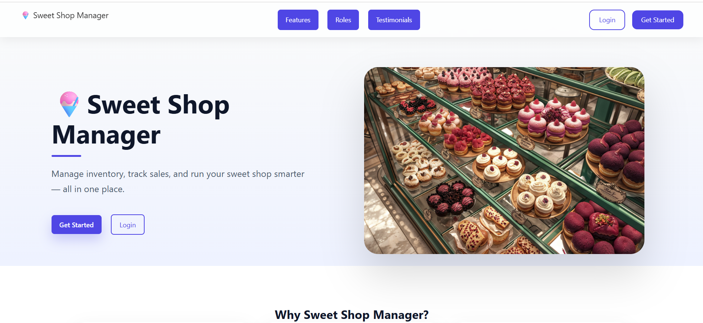
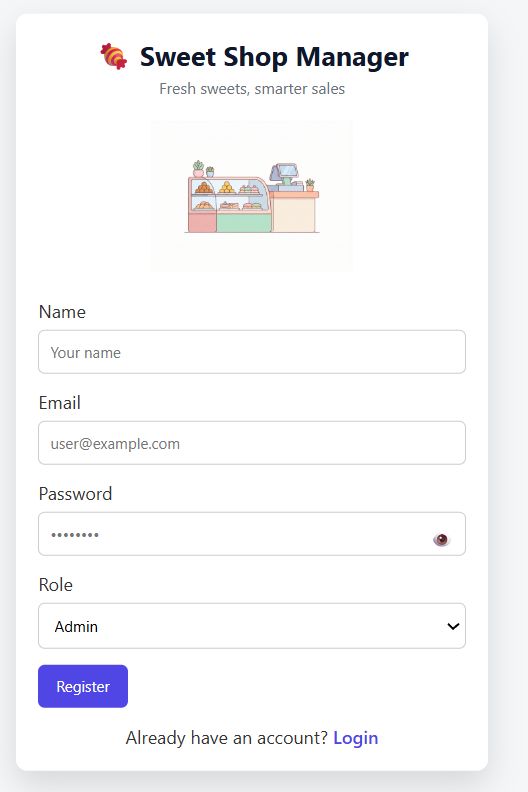
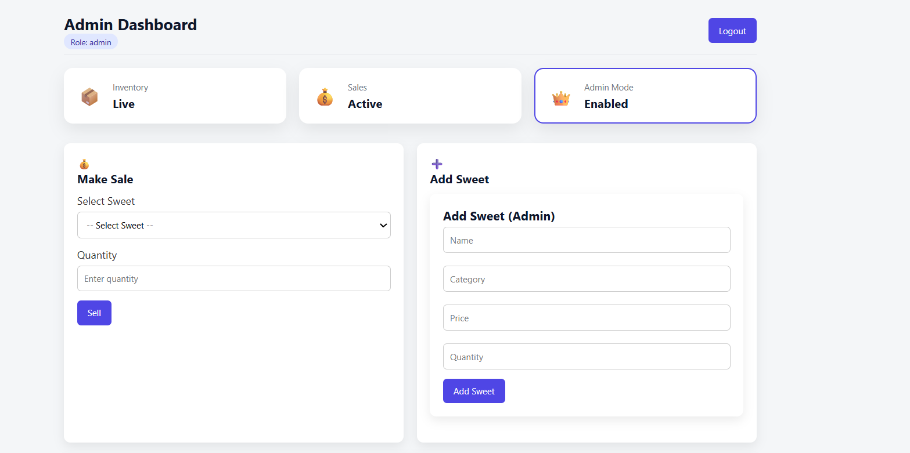
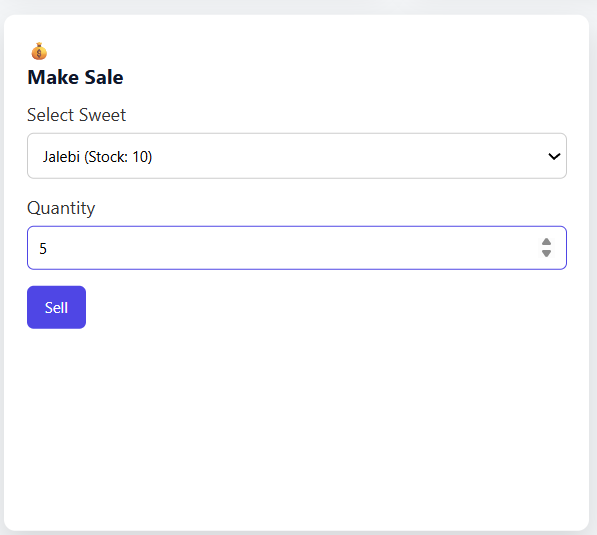
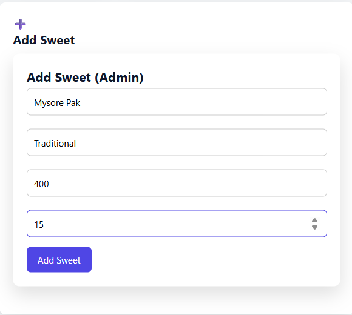
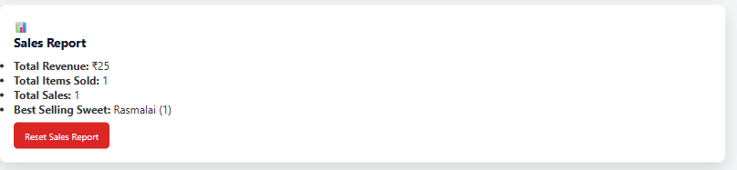

# 🍧 TDD Kata: Sweet Shop Management System

---

## 📌 Objective

The goal of this kata is to **design, build, and test a full-stack Sweet Shop Management System** using **modern development practices**.

This project demonstrates proficiency in:

- Backend API development
- Database design
- Frontend SPA development
- Authentication & Role-Based Access
- Test-Driven Development (TDD)
- Git workflows
- Responsible AI usage in software development

---

## 🚀 Live Application

### 🌐 Frontend (Vercel)
👉 https://kata-sweet-shop-management-system-five.vercel.app/

### ⚙ Backend (Render)
👉 https://kata-sweet-shop-management-system-i51v.onrender.com

> **Note:**  
> The backend is hosted on Render (Free Tier) and may take **10–20 seconds to wake up** on the first request.

---

## 🛠 Tech Stack

### 🔙 Backend
- Node.js + Express
- MongoDB + Mongoose
- JWT Authentication
- Jest + Supertest (TDD)

### 🎨 Frontend
- React + Vite
- Axios
- Role-based UI rendering
- Fully responsive (Desktop & Mobile)

---

## ✨ Core Features

### 🔐 Authentication
- User registration & login
- JWT-protected routes
- Role-based authorization (`Admin`, `Staff`)

---

### 🍬 Sweet Management
- Add new sweets (**Admin only**)
- View all available sweets
- Search sweets by:
  - Name
  - Category
  - Price range
- Update sweet details (**Admin only**)
- Delete sweets (**Admin only**)

Each sweet includes:
- Unique ID
- Name
- Category
- Price
- Quantity in stock

---

### 📦 Inventory Management
- Purchase sweet → decreases stock
- Restock sweet → increases stock (**Admin only**)
- Purchase button auto-disables when stock = 0

---

### 👥 Role-Based Access Control

| Role  | Permissions |
|------|-------------|
| Admin | Full inventory control, restock, edit, delete |
| Staff | View sweets, **sell sweets**, view inventory|

---

## 🧪 Test-Driven Development (TDD)

This project follows the **Red → Green → Refactor** cycle:

1. Write failing tests first
2. Implement minimum logic to pass tests
3. Refactor for clarity and maintainability

### ✅ Tested Areas
- Authentication flows
- Sweet CRUD operations
- Inventory purchase & restock logic
- Authorization & role checks

> Tests validate **business logic**, not just happy paths.

---

## 📸 Application Walkthrough

> Click images to view full size.

### 1️⃣ Landing Page


### 2️⃣ Register Page


### 3️⃣ Login Page


### 4️⃣ Admin Dashboard


### 5️⃣ Sell Sweets


### 6️⃣ Add Sweets (Admin)


### 7️⃣ Inventory Management


### 8️⃣ Sales Report


### 9️⃣ Staff Dashboard


---

## ⚙ Local Setup Instructions

```bash

⚙ Local Setup Instructions
1️⃣ Clone the Repository
git clone https://github.com/your-username/Kata-Sweet-Shop-Management-System.git
cd Kata-Sweet-Shop-Management-System

2️⃣ Backend Setup (/server)
cd server
npm install


Create a .env file:

PORT=5000
MONGO_URI=your_mongodb_connection_string
JWT_SECRET=your_jwt_secret


Run backend:

npm start


Run backend tests:

npm test

3️⃣ Frontend Setup (/client)
cd client
npm install


Create a .env file:

VITE_API_BASE_URL=http://localhost:5000/api


Run frontend:

npm run dev

🤖 My AI Usage

AI tools were used responsibly as productivity enhancers, not as replacements for understanding or ownership.

🔧 Tools Used

ChatGPT

GitHub Copilot

🧠 How AI Was Used

Brainstorming API structure & endpoint design

Generating boilerplate test cases for TDD

Debugging async logic, JWT, and deployment issues

Refactoring suggestions and UX improvements

🪞 Reflection

AI significantly improved development speed and architectural exploration.
All business logic, validations, and final implementations were written, reviewed, and owned manually.

AI was treated as a pair programmer, not a code generator.

🧾 Git & Version Control Practices

Frequent, meaningful commits

Clear commit messages narrating development progress

Environment variables excluded from version control

.env.example files provided

📄 Deliverables Checklist

✅ Public GitHub repository

✅ Full-stack application

✅ TDD-based backend with tests

✅ Deployed frontend & backend

✅ Comprehensive README

✅ AI usage transparency

👤 Author

Abir Chakraborty

GitHub: https://github.com/4768-Blueblooded

LinkedIn: https://linkedin.com/in/abir-chakraborty-53390926a

Resume: https://drive.google.com/file/d/1jw3ZsBqdmnaTOTBuac2wZh9ttKRzzWQP/view
